# Analisis Aplikasi Kesehatan: Latihan Rumahan

## 1. Masalah dan Pengguna

Aplikasi Latihan Rumahan menyelesaikan masalah bagi pengguna yang ingin berolahraga tetapi tidak memiliki waktu untuk pergi ke gym atau tidak memiliki peralatan olahraga. Pengguna dapat mengikuti berbagai latihan menggunakan berat badan sendiri dari rumah.

Pengguna utamanya adalah orang yang ingin menjaga kebugaran, membentuk otot, menurunkan berat badan, atau melakukan olahraga secara rutin, termasuk pemula. Aplikasi menyediakan latihan untuk semua bagian tubuh seperti perut, dada, punggung, lengan, dan kaki.

## 2. Fitur Utama

Tiga fitur utama yang dianalisis adalah:

1. **Panduan latihan dengan animasi/video**, membantu pengguna memahami gerakan olahraga dan melakukan gerakan dengan lebih tepat.
2. **Pencatatan kemajuan latihan**, membantu pengguna mengetahui perkembangan terkait target latihan, mencatat berat badan dan tinggi badan, serta menghitung kalori setiap latihan.
3. **Pengingat latihan**, mengingatkan pengguna untuk melakukan latihan sehingga membantu membangun kebiasaan olahraga secara rutin. Notifikasi latihan harian dapat ditampilkan pada perangkat mobile.

## 3. Alur Penggunaan

Salah satu contoh alur penggunaan aplikasi adalah melakukan latihan harian.

**Membuka aplikasi → memilih jenis/target latihan → melihat daftar latihan → mengikuti panduan gerakan → melakukan latihan sesuai waktu/repetisi → menyelesaikan latihan → progres latihan tercatat → menjadwalkan latihan berikutnya.**

Sebagai contoh, pengguna dapat memilih latihan untuk bagian tubuh tertentu seperti perut, dada, kaki, lengan, atau seluruh tubuh. Kemudian aplikasi memberikan panduan berupa animasi atau video sehingga pengguna dapat mengikuti gerakan tersebut.

## 4. Alasan Menggunakan Mobile

Aplikasi Latihan Rumahan menggunakan mobile karena aktivitas latihan dilakukan secara langsung oleh pengguna dengan smartphone yang mudah dibawa dan digunakan saat berolahraga. Aplikasi dapat memberikan panduan gerakan, timer, serta pengingat latihan langsung melalui perangkat yang selalu dekat dengan pengguna.

### Apakah web saja sudah cukup?

Web sebenarnya sudah cukup untuk menyediakan video latihan, panduan gerakan, dan timer. Namun, untuk penggunaan latihan sehari-hari, aplikasi mobile lebih praktis karena dapat digunakan secara langsung saat berolahraga dan lebih terintegrasi dengan fitur perangkat seperti notifikasi serta penyimpanan data latihan. Jadi, web dapat menjadi alternatif, tetapi mobile lebih sesuai untuk kebutuhan penggunaan aplikasi sehari-hari.

## 5. Integrasi Perangkat

Integrasi perangkat yang paling terlihat pada aplikasi adalah notifikasi/pengingat latihan. Fitur tersebut digunakan untuk mengingatkan pengguna agar melakukan latihan sesuai jadwal. Aplikasi juga menggunakan smartphone sebagai media untuk menampilkan animasi dan video panduan latihan.

Untuk kamera, GPS, atau biometrik, belum terdapat integrasi pada aplikasi yang dianalisis.

## 6. Usulan Perbaikan

Salah satu kendala pada aplikasi Latihan Rumahan adalah jenis latihan yang tersedia masih berfokus pada latihan tanpa peralatan. Padahal, sebagian pengguna mungkin memiliki alat olahraga di rumah, seperti dumbbell, barbell, atau tiang pull-up, tetapi belum tentu tersedia program latihan yang secara khusus memanfaatkan alat tersebut.

**Usulan perbaikan pertama**, aplikasi dapat menambahkan kategori latihan berdasarkan peralatan yang dimiliki pengguna. Misalnya, pengguna memilih Dumbbell, Pull-up Bar, atau Barbell, kemudian aplikasi menampilkan latihan yang sesuai beserta panduan gerakan, jumlah repetisi, set, dan tingkat kesulitannya. Dengan demikian, pengguna dapat menyesuaikan program latihan dengan peralatan yang tersedia di rumah.

**Usulan perbaikan kedua**, aplikasi dapat menambahkan fitur GPS untuk tracking aktivitas lari. Pengguna dapat memulai aktivitas lari dan aplikasi mencatat jarak tempuh, waktu, serta estimasi kalori yang terbakar. Data tersebut kemudian disimpan sebagai riwayat sehingga pengguna dapat melihat perbandingan dan perkembangan latihan dari waktu ke waktu, misalnya peningkatan jarak lari atau waktu tempuh.

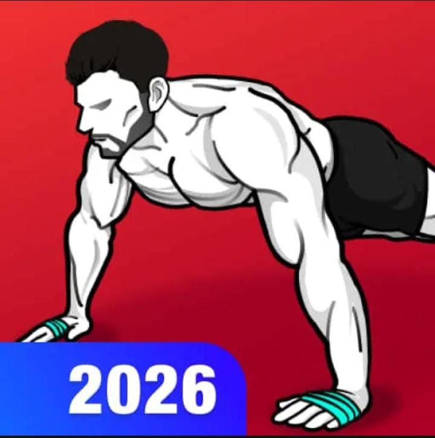

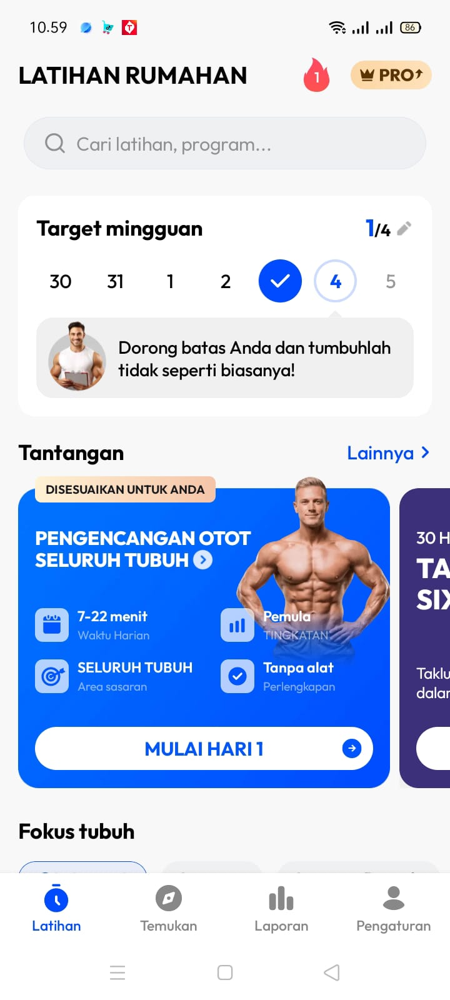

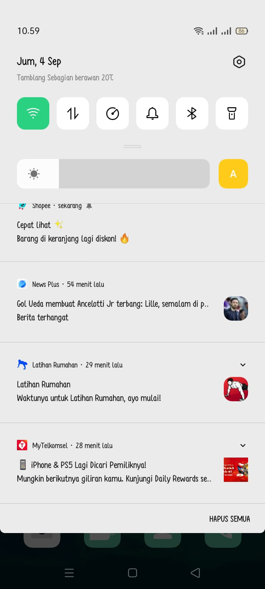

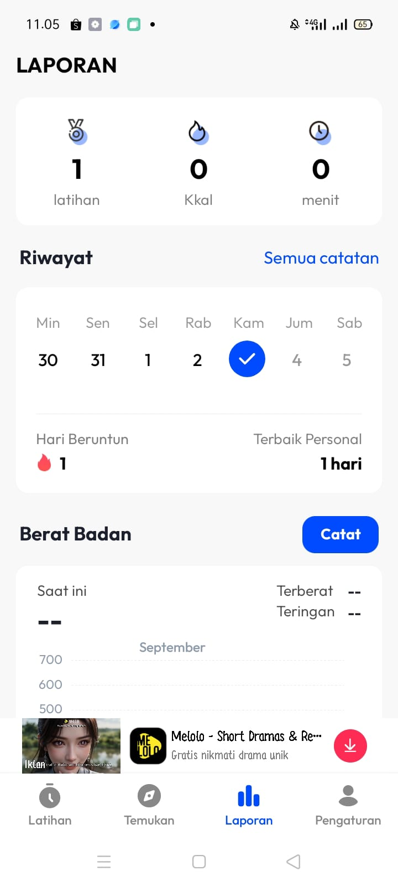

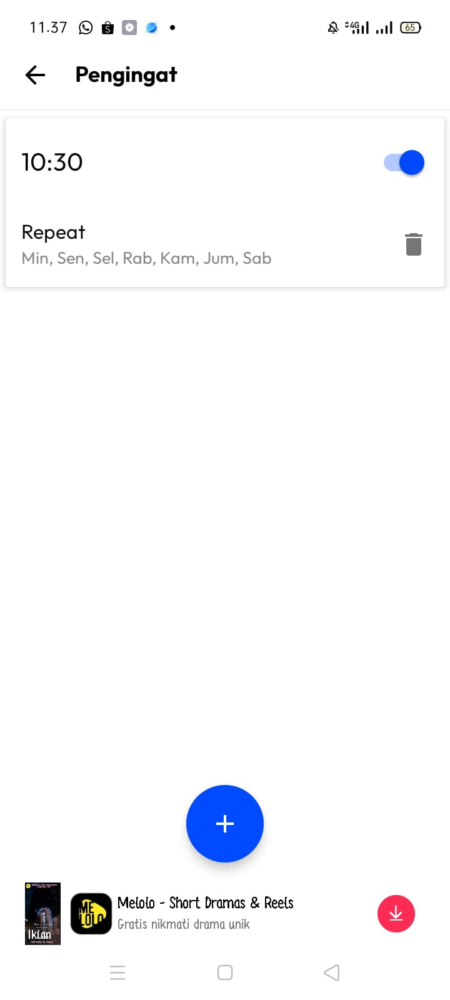

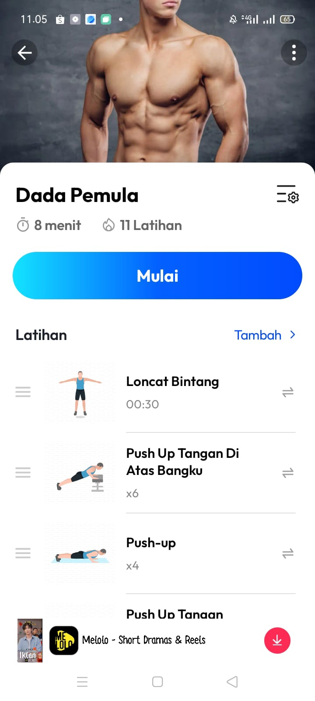

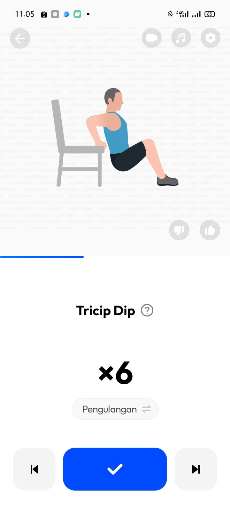

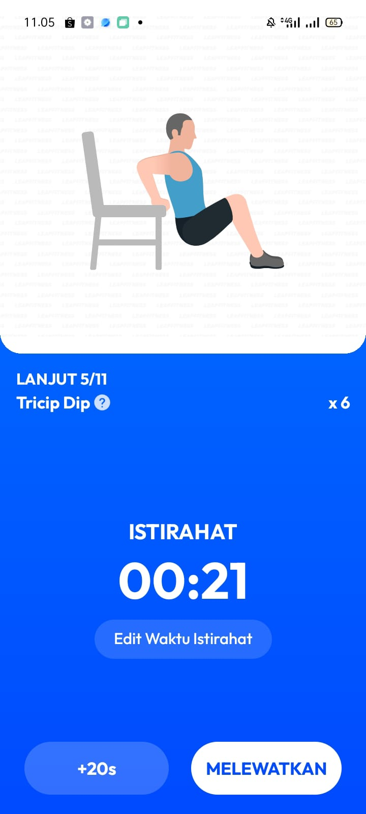

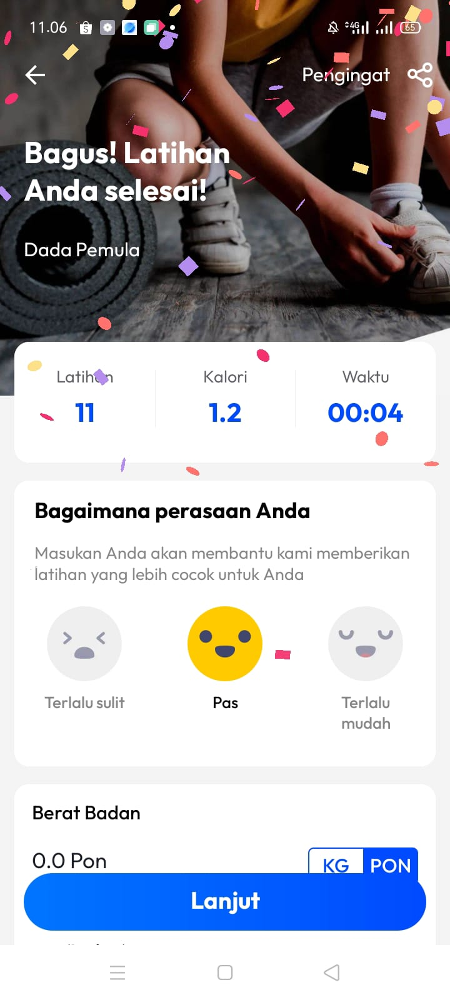

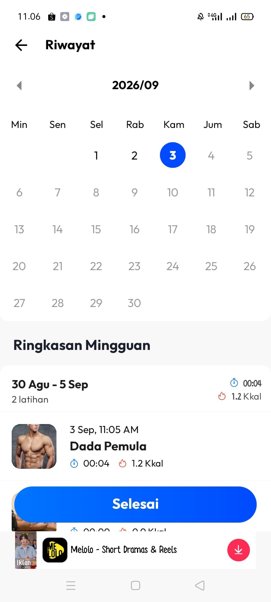

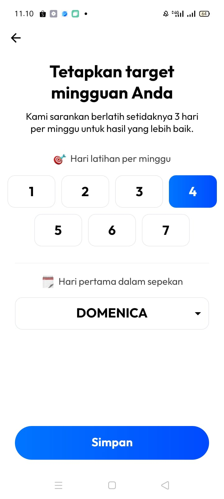
